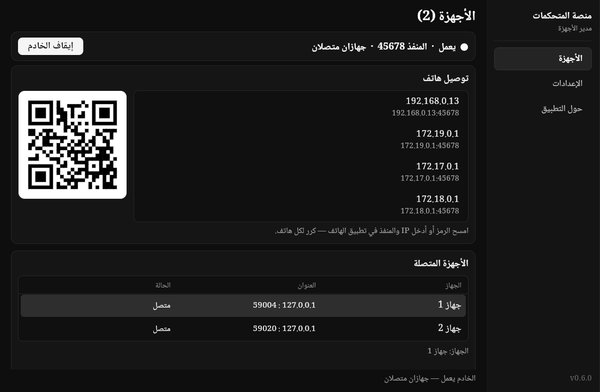

# منصة المتحكمات

حوّل هاتفك إلى يد تحكم للحاسوب. شغّل التطبيق على الحاسوب، امسح الرمز من
هاتفك، والعب — ويمكن توصيل عدة هواتف في نفس الوقت، كل واحد يظهر كجهاز
مستقل في نافذة واحدة.



## تطبيق الهاتف

التحكم يتم من تطبيق **لَعّيب** على الأندرويد
([Amr-Os/VirtualGamePad-Mobile](https://github.com/Amr-Os/VirtualGamePad-Mobile)):
ثبّته على هاتفك، وسيجد الخادم عبر رمز QR أو العنوان اليدوي.

## التنزيل والتثبيت

من صفحة [الإصدارات](https://github.com/Amr-Os/minassat-al-mutahakkamat/releases/latest)
حمّل إحدى الحزمتين:

**الأسهل (.deb لأوبونتو/دبيان):**

```bash
sudo dpkg -i minassat-al-mutahakkamat_0.6.1_amd64.deb
sudo apt-get install -f   # لتكملة أي اعتماديات ناقصة
```

**لينكس عام (AppImage — يعمل على Arch وفيدورا وغيرها):**

```bash
chmod +x minassat-al-mutahakkamat-0.6.1-linux-x86_64.AppImage
./minassat-al-mutahakkamat-0.6.1-linux-x86_64.AppImage
```

الاعتماديات: `gtk3` و`libevdev` (أوبونتو: `sudo apt-get install -y libgtk-3-0 libevdev2` —
Arch: `sudo pacman -S gtk3 libevdev` — فيدورا: `sudo dnf install gtk3 libevdev`).

**أو الأرشيف (أي توزيعة):**

```bash
tar -xzf minassat-al-mutahakkamat-0.5.0-linux-x86_64.tar.gz
cd minassat-al-mutahakkamat && ./minassat-al-mutahakkamat
```

**أو ابنِ من المصدر:**

```bash
flutter pub get
flutter run -d linux
```

### صلاحيات الإدخال (مرة واحدة)

يحتاج التطبيق الوصول إلى `/dev/uinput` لصنع أجهزة تحكم افتراضية:

```bash
sudo groupadd -f uinput
sudo usermod -a -G input,uinput $USER
sudo sh -c 'echo KERNEL=="uinput", SUBSYSTEM=="misc", MODE="0660", GROUP="uinput" > /etc/udev/rules.d/99-uinput.rules'
sudo udevadm control --reload-rules && sudo udevadm trigger /dev/uinput
```

ثم سجّل الخروج والدخول مرة واحدة. بدون هذه الخطوة ستظهر الهواتف بحالة
"محدود" (تتصل لكن بدون جهاز افتراضي).

## توصيل هاتفك

1. تأكد أن الهاتف والحاسوب على نفس شبكة Wi-Fi.
2. افتح التطبيق على الحاسوب واضغط **تشغيل الخادم** إن لم يكن يعمل.
3. في تطبيق الهاتف أدخل عنوان IP والمنفذ الظاهرين في بطاقة **توصيل هاتف**
   (أو امسح رمز QR).
4. ستظهر الهاتف في قائمة **الأجهزة المتصلة** — كرر نفس الخطوات لأي هاتف
   آخر، لا حاجة لفتح التطبيق أكثر من مرة.

## الاستخدام اليومي

- **إعادة التسمية**: حدد الجهاز ثم اضغط **إعادة التسمية** (أو نقرة مزدوجة
  على صفه). يُحفظ الاسم حسب عنوان IP فلا يضيع عند إعادة الاتصال.
- **وضعا الإدخال** (من الإعدادات):
  - *يد تحكم افتراضية*: كل هاتف يصبح يد تحكم مستقلة (Minassat Gamepad،
    Minassat Gamepad 2، …) — مناسب للألعاب التي تدعم يد التحكم وللعب
    الجماعي على نفس الجهاز.
  - *محاكاة لوحة المفاتيح والفأرة*: بالتعيين الافتراضي (Enter وEsc وWASD
    والأسهم والنقر) — مناسب للألعاب بدون دعم يد التحكم.
- **اللغة**: العربية (من اليمين لليسار) افتراضيًا، ويمكن التحويل إلى
  English من الإعدادات.
- **قطع الاتصال**: زر لقطع جهاز محدد وآخر لقطع الكل.

## الإعدادات

من صفحة الإعدادات: طريقة الإدخال، منفذ الخادم (0 = تلقائي)، سرعة المؤشر،
اللغة. تُحفظ في `~/.config/minassat-al-mutahakkamat/settings.json`.
تغيير المنفذ يعيد تشغيل الخادم تلقائيًا؛ تغيير طريقة الإدخال يسري على
الهواتف التي تتصل بعد ذلك.

## حل المشاكل

- **تعذّر تشغيل الخادم (المنفذ مشغول)**: غيّر المنفذ من الإعدادات أو أغلق
  البرنامج الذي يستخدمه.
- **الهاتف لا يتصل**: تأكد من نفس الشبكة، وجرّب كتابة IP والمنفذ يدويًا،
  وتحقق أن جدار الحماية يسمح بالمنفذ.
- **الحالة "محدود"**: راجع خطوة صلاحيات `/dev/uinput` أعلاه.
- **تقطّع الإدخال**: قرّب الهاتف من الراوتر وتجنب ازدحام الشبكة.

## الشكر والرخصة

هذا المشروع مبني على عمل **kitswas** في
[VirtualGamePad-PC](https://github.com/kitswas/VirtualGamePad-PC)
(البروتوكول والفكرة والتعيينات الافتراضية)، وهو مرخّص مثله تحت
**[GPL-3.0](LICENCE.TXT)**.

التفاصيل التقنية (البروتوكول، البنية، الحقن، الاختبارات) في
[docs/TECHNICAL.MD](docs/TECHNICAL.MD).
